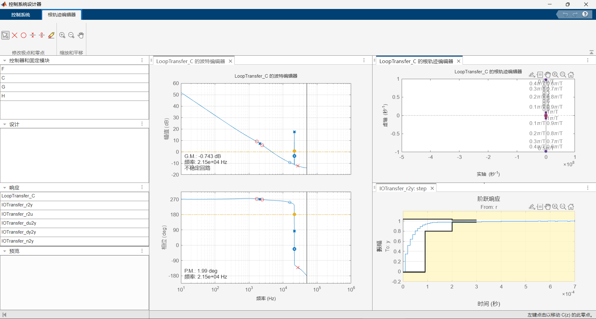

# RM2025_SuperCapController_G4_FMAC
## RoboMaster2025赛季 超级电容控制器开源 五邑大学-IMCA战队

## 简介
本开源项目包括程序代码，硬件设计，以及Matlab调参方法。其中程序代码有两个版本，其一是使用基于Fmac的数字滤波器代替PI控制的电流环控制方案，其二为使用单片机内部运算放大器+硬件计算单元Fmac实现的电流环控制方案。

前言：上个赛季的超级电容控制器存在诸多问题，由于使用半桥DCDC，无法完全利用电容的全部空间，并且响应速度有限，常有超功率的情况发生，遂重新设计超级电容控制器。本项目设计时，参考了诸多优秀开源项目，在此表示感谢。

## 硬件选型

Mos管选用csd18540q5b，耐压有60V，在调试的时候，难免会出现环路震荡，导致升压出过高的电压，之前所选用的耐压仅为40V的mos经常出现过压击穿的情况。该mos管导通内阻低至1.8mΩ，并且价格低廉。

栅极驱动器选用UCC27282DR。初版选用开源方案中的UCC27211栅极驱动，但经常出现栅极芯片烧毁的情况，换用UCC27282DR后栅极驱动烧毁的情况减少，但还是偶尔会烧坏栅极驱动芯片，经过排查，是由于PCB布局存在问题，电流环路的面积过大，产生过大的干扰信号，导致栅极驱动工作异常，以至于烧毁。重新布局画板后，并在栅极驱动芯片的供电端串接0.35A的自恢复保险丝，至今没有再出现栅极驱动烧毁的问题。

电流路径拓扑图及采样点设置如下：


电流采样芯片都采用INA240A1PWR，该芯片的精度较高，增益误差典型值为±0.05%，在通过外部仪器进行线性化校准后，电管侧电流检测误差为±0.01A。通过配置检流电阻的阻值配置不同端口的量程，电管侧电流采样的量程为±8.25A，电容侧电流采样的量程为±41.25A，底盘电机侧电流采样的量程为±16.5A。

功率电感采用PQ2620-22uH的扁平线电感，初版使用的1770尺寸的一体成型贴片电感温升电流为12A，在大电流的工作状态下发热非常严重，于是更换温升电流更高的扁平线电感，降低热损耗。

DCDC电路设计瞬时最大峰值功率为400W，持续功率200W。电容端口电流限制充电15A，放电24A。

## Mos驱动逻辑
本项目采用四开关升降压的拓扑，可以更好地利用电容组的容量，并且在相同的功率下，电压越高，电流越小。由于栅极驱动电路原理的限制，无法实现上管100%占空比，于是通过软件计算实现三模态+中心对齐的MOS管驱动信号。
上管的驱动信号如下图所示，下管的驱动信号则与上管互补。


若当CMP1>(CMP3-CMP2)为buck状态，则CMP1<(CMP3-CMP2)为boost状态。其中CMP2-CMP1=PER-CMP3。两侧半桥驱动逻辑的中心对齐，能使两侧半桥状态切换的时间点间隔最大，减少两侧半桥的互相影响。但带来新的问题，由HRTIM触发的电流采样受到CMP2处mos开关的干扰，若避开mos开关的干扰，把采样触发时间点设置在CMP3和PER的中点，导致采样的触发时间点不稳定。由于HRTIM启用预装载，在一周期内的时间误差可以忽略。在实际使用中，信号的调制消耗的性能不小，笔者通过用Q1.15代替浮点，能提高一定的性能。笔者认为，使用HRTIM的双向计数来实现中心对齐才是最优解。

笔者在阅读参考资料时发现，其他开源超电时在调制四开关MOS的驱动信号时，存在两侧半桥的下管同时导通的状态，虽然此状态的占空比很低，但仍会有一定的负面影响。

## 环路方案
本项目的控制环路不是常用的电流环和电压环的并环控制，而是电流环和功率环串行进行控制。拓扑图如下：


电流环的频率为100KHz，与mos管的开关频率相同，由于单片机性能有限将功率环设置在50KHz。电流环所用的2p2z数字滤波器在STM32的Fmac单元中计算。在功率环中直接用底盘实时功率直接计算得出目标电容电流，能提高响应速度。

由于没有电压环，所以要通过其他方法限制电容的充电电压。“目标电管功率”的数值不再直接等于当前等级下的功率值，而是由一个10Hz决策任务计算而出。它受到2个因素的限制：1、当电容接近满电时，将会逐步降低“目标电管功率”，从而实现“涓流充电”的效果。此外由于“底盘功率反馈”的存在，在“涓流充电”时，只是降低从电管获取的电能，而不会影响动能回收的效果。2、当Can通信反馈的缓存能量<60J时，将按比例降低“目标电管功率”。当不满足上述两个条件，那么“目标电管功率”就等于当前等级下的功率值，此时以最大的功率充电。

### 响应测试图如下：
底盘接口链接电子负载，参数如下：


功率响应如下：


图注：纵轴为功率，单位为W。黄色为底盘接口功率，绿色为电管接口功率，红色为电管接口目标功率。

### 基于内部的运算放大器的硬件环路

在区域赛的前几天，成功做出使用运算发大器+Fmac的电流环的超电。此方案使用单片机内部运算放大器来求电流误差，并把数据交由Fmac单元计算，除了PWM调制的环节以外，全部环节为片上外设+DMA。拓扑图如下：


使用DAC来设置目标电流，但由于误差DAC和ADC存在误差，不得不加入电流误差补偿环来消除误差。但剩下的CPU性能不足以运行高速的功率环，只能降频到10KHz。过于低频的功率环不再适合把电流环设置在电容侧电流上，于是此方案把电流环设置在电管电流上。笔者认为，如果使用电管电流作为底层电流环，那数控电源方案还不如使用更为成熟的模拟电源方案。因此，此方案并没有详细优化，在此提供代码以供参考学习，如需使用，需要添加飞线将电流反馈线链接到(PB10)。

## 调参方法
由于本项目使用的是数字滤波器代替PI控制，所以调参方法与PI控制不同。笔者通过Matlab和串口回传的数据，在频域下进行调参。

### 数据获取

由于是基于频域的调参方法，那么数据的帧率就要够高。笔者使用串口传输环路数据，使用的上位机软件为“匿名助手”，该软件的通信协议有数据校验，可以剔除错误的数据包，因为串口的波特率较高，会有较多的错包，笔者在使用“vofa”时，就发现有很多数据有异常。并且“匿名助手”带有帧速率显示，可以直观地看到数据的帧率，以便进行z域传递函数的估算。

笔者使用的串口的波特率为15Mbit/s，在测试时，最大有效带宽可达12Mbit/s，在传输两个浮点数（包括协议开销）时，包帧率可达96KHz，接近电流环速度。但在实际使用中，由于协议中含有和校验和附加校验，严重消耗单片机性能，导致在于电流环运行时，串口回传的包帧率只有一半左右。并且由于串口回传的数据包有一定的错位，导致效果不是很好。

把被控系统的时域数据通过串口发送到电脑上，再导出为表格。

### Matlab调参
笔者使用Matlab的“控制系统设计器”进行调参，首先把串口回传的受控模型时域数据导入到Matlab
再使用以下命令进行z域传递函数的估算
```matlab
sys = tfest(X,Y,np,'Ts',t)
sys1= d2d(sys,T) %按指定时间重采样
sys2=tf(sys1) %切换格式，以导入设计工具
```
再把“sys2”导入到“控制系统设计器”


通过在模块“C”中添加积分器和零极点，就能设计出所需的数字滤波器。但受限于数据的精度，并不能调出最佳的参数。
经过补偿后的系统：


由于数据存在一定的错误，导致在设计工具中的bode图并不准确。

### Fmac配置
由于STM32F4的Fmac单元的运算数据所使用的格式是Q1.15，所以需要把传递函数参数转换为Q1.15格式。笔者提供一个脚本用于把2P2Z的z域传递函数转换为Q1.15格式。

## 开源地址
[本项目GitHub开源地址](https://github.com/wuhuzzk/RM2025_SuperCapController_G4_FMAC)

[本项目论坛开源地址](https://bbs.robomaster.com/article/723414)

[下载地址releases](https://github.com/wuhuzzk/RM2025_SuperCapController_G4_FMAC/releases)


## 参考文献

[[1]【RM2021-双向超级电容硬件开源】大连理工大学-凌bug](https://bbs.robomaster.com/article/8435)

[[2]【RM2024-超级电容控制板开源】哈尔滨工业大学（深圳）南工骁鹰战队](https://bbs.robomaster.com/article/17423)

[[3]【开源】基于硬件补偿器的250kHz电流环计算频率的超级电容控制器 ](https://bbs.robomaster.com/article/55528)

## 其他
联系方式：QQ：276608685
开源协议：本开源项目遵循GPLv3协议，允许自由传播和修改，但必须保留原作者的版权声明。